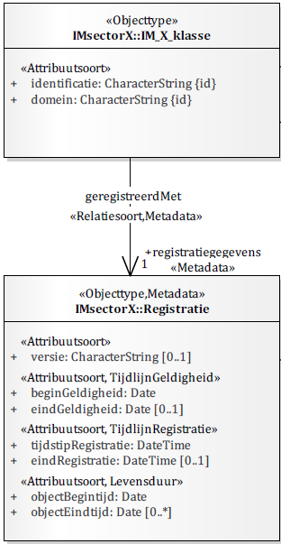

# Overzicht logisch gegevensmodel IBRO

## Definitie
In de Integrale Bronregistratie Objecten (IBRO) worden de gegevens vastgelegd omtrent gesynchroniseerde objecten uit de BAG, BGT en WOZ. Het conceptueel informatiemodel IMIBRO [[IBROCM]] definieert het informatiedomein van de IBRO en vormt de basis voor dit logische gegevensmodel, het IBRO-LM, in het kader van de IBRO.

## Beschrijving

Op basis van het conceptueel informatiemodel IMIBRO is het mogelijk om meerdere logische gegevensmodellen te maken, afhankelijk van de beoogde implementatie. Technische aspecten maar ook inhoudelijke scope kunnen hier een rol bij spelen. Dit logisch gegevensmodel is generiek van opzet en heeft een brede scope. 

<aside class="issue">
Hier nog de gemaakte keuzes in het logisch gegevensmodel beschrijven op basis van keuzes die in de architectuur van Mercator gemaakt worden.
</aside>

Inhoudelijk is het IBRO-LM uiteraard afgeleid van het conceptueel informatiemodel IBRO, dat weer is gebaseerd op [[NEN3610]]. Daarnaast is de inhoud afgestemd op OGC CityGML 3.0 [[CityGML3]]. Dit is vastgelegd in een [IBRO-CityGML mapping](./citygml-mapping.md).

### Identificatie

Voor de identificatie van objecten maken we gebruik van het identificatiepatroon van [[NEN3610]]. 

Een belangrijk uitgangspunt is dat de identificatie van een object gedurende zijn gehele levenscyclus gelijk blijft.

### Status van objecten in de registratie

In het conceptueel informatiemodel is uitgedrukt hoe je aan een object kan zien in welke levensfase het zich bevindt. Dit gaat om de levenscyclus van een object in de werkelijkheid. 

Het logisch gegevensmodel voegt hier informatie over de status van objecten in de *registratie* aan toe. 

In IBRO-LM is de status `Niet gerealiseerd` opgenomen. Dit is een status die kan worden toegekend aan objecten waarvan het ontwerp of plan uiteindelijk niet is gerealiseerd.

### Historie - tijdlijnen van informatieobjecten

<aside class="issue">
Dit overgenomen uit disgeo documentatie; check of dit ook voor IBRO zo klopt. 
</aside>

Een informatieobject is een set gegevens die een beschrijving geeft van een object in de te beschrijven werkelijkheid (hierna werkelijkheid). [[NEN3610]] biedt eigenschappen om van informatieobjecten uit te drukken wat de tijdlijnen geldigheid en registratie zijn. () 

<figure id="nen3610-registratiegegevens">
  
  <figcaption>NEN 3610:2022 - Registratiegegevens</figcaption>
</figure>

`Tijdlijn Geldigheid` is opgenomen via de attributen `beginGeldigheid` en `eindGeldigheid`. 
`Tijdlijn Registratie` is opgenomen via de attributen `tijdstipRegistratie` en `eindRegistratie`.

De tijdlijn geldigheid beschrijft wanneer (de gegevens in) een informatieobject als waarheid beschouwd kunnen worden in de werkelijheid. Dit vormt dan ook de basis voor het kunnen tijdreizen langs de geldigheidstijdlijn.

Hoe deze tijdlijn per object wordt ingevuld is een functionele keuze die, op basis van het objecttype en het doel van het registreren van informatieobjecten voor dat objecttype, gemaakt moet worden. Zo kan het voor fysieke objecten voor de hand liggen om het begin van de levensduur (de begindatum geldigheid van het eerste voorkomen in de levensloop van een object) te laten aansluiten op het moment van het ontstaan van dit object in de werkelijkheid.

De tijdlijn registratie beschrijft wanneer (de gegevens in) een informatieobject opvraagbaar was. Dit zijn technisch tijdstippen die bepaald worden door de gegevensverstrekkende systemen.

### Herkomst 

<aside class="issue">
TODO: beschrijven lineage event sourcing: hoe ga je gebeurtenissen die hebben geleid tot een informatie-object representeren. Er is mogelijke input uit <a href="https://github.com/Geonovum/disgeo-im/blob/main/respec-docs/algemeen.md#brongegevens-van-informatieobjecten">DisGeo</a>. 
</aside>

### Geometrie

Voor de representatie van de locatie, oriëntatie en vorm van een object uit de werkelijkheid, gebruiken informatiemodellen geometrieën. De dimensie van een representatie variëert van nuldimensionaal (0D) tot driedimensionaal (3D). Objecten worden altijd geplaatst in een tweedimensionele (2D), of driedimensionele (3D) ruimte. 

In de IBRO is het uitgangspunt om objecten in 3D vast te leggen. Voor de vastlegging van (informatie over) geometrieën volgen we CityGML 3.0 [[CityGML3]], de internationale standaard voor 3D stadsmodellen. Representatie van 3D geometrieën in CityGML is gebaseerd op ISO 19107 [[iso-19107-2003]]. Deze standaard voorziet zowel in de opname van de coördinaten van de geometrie, als van het coördinatenstelsel. 

Van sommige objecten is de onderlinge relatie van belang; ook wel *ruimtelijke relaties* genoemd. De BGT-gegevenscatalogus beschrijft bijvoorbeeld welke objecten samen een landsdekkend geheel vormen. Om deze objecten correct aan de BGT te kunnen aanleveren moeten deze ruimtelijke relaties ook in de IBRO geborgd worden. Bovendien heeft een geometrische representatie vaak ook kwaliteitskenmerken, bijvoorbeeld ten aanzien van *nauwkeurigheid* en *inwinregels*. 

Samengevat legt het informatiemodel de volgende informatie over een geometrie vast: type, dimensie, coordinaatreferentiesysteem (CRS), ruimtelijke relaties en Kwaliteitskenmerken (o.a. nauwkeurigheid, inwinregels en topologische regels). De volgende paragrafen beschrijven welke eisen op het informatiemodel DiSGeo van toepassing zijn én hoe die concreet worden vastgelegd. 

Het conceptueel informatiemodel IBRO legt slechts generiek vast dat objecttypen al dan niet een geometrische representatie hebben. In het logisch gegevensmodel wordt dit voor elk objecttype verder ingevuld met een specifiek geometrietype. We gebruiken de ISO 19107-geometrietypen uit onderstaande tabel:

| Primitieve   | In ISO 19107 - Enkelvoudig   | In ISO 19107 - Aggregatie    |
| ---          | ---                         | ---                         |
| Punt         | `GM_Point`                  | `GM_MultiPoint`             |
| Lijn         | `GM_Curve`                  | `GM_MultiCurve`             |
| Vlak         | `GM_Surface`                | `GM_MultiSurface`           |
| Volume       | `GM_Solid`                  | `GM_MultiSolid`             |

Hierbij geldt dat net zoals in CityGML alleen lineaire interpolatie is toegestaan; bogen zijn niet toegestaan.

<aside class="issue">
Vaak verwijzen we voor de geldende afspraken over geometrie naar [[GIMEG]] en naar de ISO-standaard Simple Features [[iso-19125-1-2004]]. Omdat Simple Features zich echter beperkt tot 2D geometrie, is dat in dit geval niet toereikend. Wat wel zou kunnen is ons beperken tot de geometrietypen die in <a href="https://www.cityjson.org/specs/2.0.1/#geometry-objects">CityJSON</a> zijn toegestaan. Dat zijn de meest gebruikelijke 3D geometrietypen.
</aside>

### Dimensies

Het logisch gegevensmodel IBRO is een 3D model: het gaat uit van 3D-primitieven in een 3D-ruimte. Per objecttype kan de wijze van vastlegging verschillen. In sommige gevallen representeert een volume (3D-model) het object het beste. In andere gevallen volstaat een punt, lijn of vlak (2D-model) met eventueel een hoogteligging (2.5D-model). Het verschilt per onderwerp of een uitwerking in 2D (bijv. `GemeenteGebied`), 2.5D (bijv. `Verharding`), danwel 3D (bijv. `Pand`) nodig is.

### Coordinaatreferentiesystemen

Iedere geometrische dataset/geometrie moet zijn voorzien van een verwijzing naar het coördinaatreferentiesysteem waarin de coördinaten van de geometrie zijn beschreven [[NEN3610]]. Welk coördinaatreferentiesysteem in een situatie van toepassing is, wordt bepaald door verschillende factoren, zoals dimensionaliteit van de gebruikte primitieven, dimensionaliteit van de ruimte en het toepassingsgebied. 

Het toepassingsgebied betreft het "Europese grondgebied van het Koninkrijk der Nederlanden, inclusief de daarbij behorende territoriale wateren" en meer specifiek het grondgebied van de gemeente Rotterdam of een andere gemeente die de IBRO implementeert. Het gaat om data met 3 dimensies. Het toe te passen CRS is dan RDNAP (EPSG:7415), Samengesteld RD en NAP. Zie voor meer informatie de [CRS handreiking](https://docs.geostandaarden.nl/crs/crs/).

Maak gebruik van een lijnlengte van maximaal 200 meter. Dit volgt het langelijnenadvies van het NSGI, dat is overgenomen in [[HRCRS]] in verband met compatibiliteit met RDNAPTRANS™.

<aside class="issue">
RD of toch ETRS89?
</aside>

Verder is bij het onderdeel Netwerk ook lineair refereren van belang. Daarvoor gebruiken we Linear Reference Systems (LRS), zie: [[ISO-19148]], [INSPIRE](https://inspire.ec.europa.eu/id/document/tg/tn), en de [Richtlijn BPS](https://wetten.overheid.nl/BWBR0015962/2003-12-05). 

### Ruimtelijke relaties en topologie
Het informatiemodel IBRO gaat als bron dienen voor gegevens uit verschillende geo-basisregistraties. Voor deze basisregistraties gelden reeds bestaande regels ten aanzien van de topologische kwaliteit. De kwaliteit van de gegevens in het IBRO moet zodanig zijn dat aan deze regels kan worden voldaan. 

Omdat ze in het [[EMSO]] geformuleerd staan en van onverminderd belang zijn voor de kwaliteit van de IBRO, herhalen we voor de volledigheid een aantal basisprincipes op deze plek. 
- De reële objecten bedekken met hun x,y,z geometrie het volledige grondgebied van [een gemeente in] Nederland
- Geometrieën van objecten kunnen boven elkaar liggen
- Geometrieën van objecten kunnen elkaar uitsluiten
- Functionele ruimten zijn niet landsdekkend (of gemeente dekkend) en mogen elkaar overlappen
- Geografische ruimten zijn niet landsdekkend (of gemeente dekkend) en mogen elkaar overlappen

Omdat het logisch gegevensmodel IBRO een 3D model is, zijn de regels ten aanzien van topologische kwaliteit anders dan in vergelijkbare 2D modellen zoals de BGT. Uitgangspunt is dat objecten die zich in de werkelijkheid op een bepaalde wijze tot elkaar verhouden (bijvoorbeeld een verharding ligt bovenop een overbrugging) ook in de registratie op deze wijze tot elkaar verhouden (bijvoorbeeld dat uit de z-coördinaten van de verharding en de overbrugging blijkt dat de verharding bovenop de overbrugging ligt). Daarnaast is het van belang dat er op elke fysieke locatie in de werkelijkheid (elke x,y-coördinaat) altijd tenminste een reëel object aanwezig is (water, begroeiing, gebouw, verharding, kunstwerk, constructies of onbepaald terrein).\
